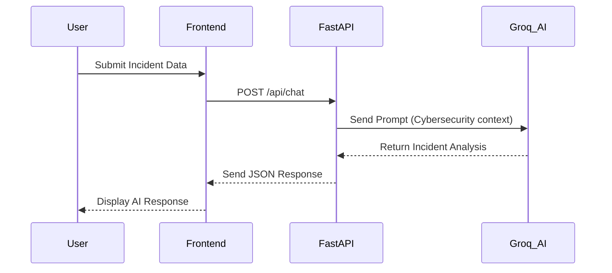
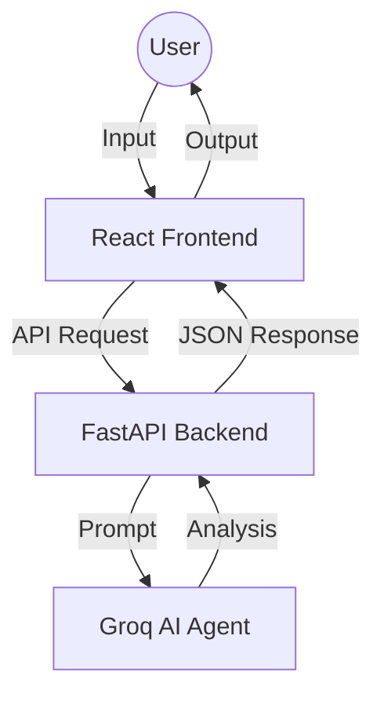

# AI Agent for Cybersecurity Incident Response

u2u Internship Project — 2026

## What this project is

This project is an AI agent designed to help with cybersecurity incident response. When a security incident is reported, the agent looks at the type of incident, checks past data and known vulnerabilities, and gives a clear set of response steps — instead of an analyst having to dig through documentation manually under pressure.

The project is built in stages, matching the tasks below.

## Repo structure

```
u2u-internship-project/
├── README.md                  ← this file
├── data_raw/                  ← raw, uncleaned data (Task 1)
│   └── incidents_db_raw.csv
├── data/                      ← cleaned + reference data (Task 1, 2, 3)
│   └── README.md              ← detailed explanation of every data file
├── src/                       ← code
│   └── data_cleaning.ipynb    ← Task 2: data cleaning notebook
├── reports/                   ← Task 2 & 3 deliverables
│   ├── data_cleaning_report.md
│   └── storage_documentation.md
└── deployment/                ← Task 3: stored database
    └── incident_response.db
```

## Task 1 — Data Collection
Collected raw data needed for the agent: incident logs, network logs, known CVE data, response playbooks, and a reference PDF guide. All explained in detail in `data/README.md`.

## Task 2 — Data Cleaning
Took the raw incident data and cleaned it using Python (Pandas) in `src/data_cleaning.ipynb`. Fixed duplicate rows, missing values, inconsistent casing, and an invalid time value. Full before/after breakdown is in `reports/data_cleaning_report.md`.

## Task 3 — Data Storage
Loaded the cleaned data into a SQLite database (`deployment/incident_response.db`) with two tables: `incidents` and `network_logs`. Reasoning and schema are documented in `reports/storage_documentation.md`.

## How to run the cleaning notebook
```bash
cd src
jupyter notebook data_cleaning.ipynb
```
Run all cells top to bottom. It reads from `../data_raw/incidents_db_raw.csv` and writes the cleaned file to `../data/incidents_db_cleaned.csv`.

## How to check the database
```python
import sqlite3
import pandas as pd

conn = sqlite3.connect('deployment/incident_response.db')
df = pd.read_sql('SELECT * FROM incidents', conn)
print(df)
```

### SYSTEM ARCHITECTURE



### SYSTEM ARCHITECTURE OVERVIEW


### HOW TO RUN
**Backend:**
1. Navigate to the root folder: `cd .`
2. Install dependencies: `pip install -r requirements.txt`
3. Start the server: `uvicorn src.main:app --reload`

**Frontend:**
1. Navigate to the frontend folder: `cd frontend`
2. Install dependencies: `npm install`
3. Start the app: `npm start`
